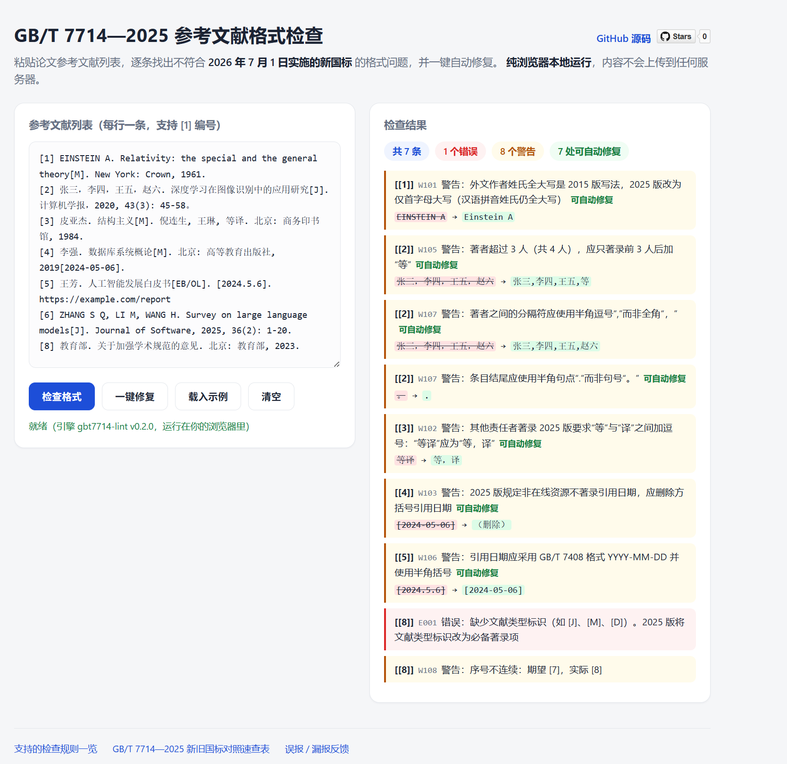

# gbt7714-lint

[](https://github.com/hc-ui/gbt7714-lint/actions/workflows/ci.yml)
[](LICENSE)

Word 里抄出来的参考文献，对照 **GB/T 7714—2025** 逐条检查，能修的一键修。

**不是** BibTeX 宏包，也不是 Zotero 插件。你从 Word / WPS 粘出来的那段纯文本，就能用。

**[打开浏览器试用 →](https://hc-ui.github.io/gbt7714-lint/)**　免安装，数据不出本机。国标已于 **2026-07-01** 实施。



English: a zero-dependency linter/auto-fixer for **plain-text** GB/T 7714—2025 bibliographies. [Try it in the browser](https://hc-ui.github.io/gbt7714-lint/).

## 为什么需要它

GB/T 7714—2025 已于 2026 年 7 月 1 日实施，高校学位论文和期刊投稿都在陆续切换新国标。但你手里的参考文献往往是 Word 里的一段**纯文本**——BibTeX 转换器、LaTeX 宏包、Zotero CSL 样式都帮不上忙。

`gbt7714-lint` 直接检查纯文本参考文献列表，逐条指出不符合 2025 新国标的地方，并自动修复其中机械性的部分，例如：

- 外文作者姓氏 `EINSTEIN A`（2015 版写法）→ `Einstein A`（2025 版），而汉语拼音姓氏 `ZHANG S Q` 与机构缩写 `WHO`、`UNESCO` 正确保留全大写
- `倪连生, 王琳, 等译` → `倪连生, 王琳, 等，译`（2025 版其他责任者新增逗号）
- 纸质文献误标引用日期 `2019[2024-05-06]` → `2019`（2025 版规定非在线资源不著录引用日期）
- 著者超过 3 人未加"等 / et al."，中英文条目混用"等"和"et al."，或用顿号"、"分隔著者
- 缺失或未知的文献类型标识（2025 版将其改为必备项，并新增 `PP` 预印本、`DS` 数据集、`A` 档案、`MM` 缩微资料载体）
- 引用日期 `[2024.5.6]` → `[2024-05-06]`，且区分"(更新日期)"与"[引用日期]"两种括号
- 全角句点误用作著录符号、条目缺句点、类型标识前多余空格、序号跳号或重复

## 安装

```bash
pip install git+https://github.com/hc-ui/gbt7714-lint.git
```

无第三方依赖，Python 3.9+。尚未上 PyPI，请从 Git 安装。同系列还有正文序号检查：[zh-cite-check](https://github.com/hc-ui/zh-cite-check)。

## 使用

```bash
# 检查（从 Word 复制参考文献，存成 refs.txt）
gbt7714-lint refs.txt

# 自动修复，结果写入新文件
gbt7714-lint refs.txt --fix -o refs_fixed.txt

# 忽略某些规则（例如你的期刊不要求引用日期）
gbt7714-lint refs.txt --ignore W104,W108

# 学位论文要求统一半角标点时
gbt7714-lint refs.txt --fix --punct half -o refs_fixed.txt

# 机器可读输出（供脚本/CI 使用）
gbt7714-lint refs.txt --json

# 从剪贴板 / 管道读取
Get-Clipboard | gbt7714-lint -      # PowerShell
pbpaste | gbt7714-lint -            # macOS
```

检查输出示例：

```text
检查 refs.txt：共 10 条参考文献
  [1] 第3行 [W101] 警告：外文作者姓氏全大写是 2015 版写法，2025 版改为仅首字母大写（可自动修复）
      'EINSTEIN A' → 'Einstein A'
  [4] 第6行 [W103] 警告：2025 版规定非在线资源不著录引用日期，应删除方括号引用日期（可自动修复）
      '[2024-05-06]' → ''
  [9] 第12行 [E002] 错误：文献类型标识应使用大写字母：[ds/ol] 应为 [DS/OL]（可自动修复）
  [11] 第13行 [E001] 错误：缺少文献类型标识（如 [J]、[M]、[D]）。2025 版将文献类型标识改为必备著录项
合计：2 个错误，12 个警告；其中 12 处可用 --fix 自动修复
```

也可以作为 Python 库调用：

```python
from gbt7714_lint import lint_text, fix_text

text = open("refs.txt", encoding="utf-8").read()

for issue in lint_text(text).issues:
    print(issue.rule_id, issue.message)

fixed, remaining = fix_text(text)
```

## 规则一览

| 规则 | 级别 | 说明 | 自动修复 |
|------|------|------|:---:|
| E001 | 错误 | 缺少文献类型标识（2025 版必备项） | – |
| E002 | 错误 | 未知或小写的文献类型/载体标识 | 部分 |
| W101 | 警告 | 外文姓氏全大写（2015 版风格），应仅首字母大写 | ✓ |
| W102 | 警告 | 其他责任者"等译"应为"等，译"（2025 版新规） | ✓ |
| W103 | 警告 | 非在线资源著录了引用日期（2025 版禁止） | ✓ |
| W104 | 警告 | 在线资源缺少引用日期 | – |
| W105 | 警告 | 著者超过 3 人未加"等 / et al." | ✓ |
| W106 | 警告 | 日期未采用 GB/T 7408 的 YYYY-MM-DD 格式 | ✓ |
| W107 | 警告 | 全角句点、全角方括号误用作著录符号 | ✓ |
| W108 | 警告 | 参考文献序号不连续或重复 | – |
| W109 | 警告 | 条目结尾缺少句点 | ✓ |
| W110 | 警告 | 中文文献误用"et al."或外文文献误用"等" | ✓ |
| W111 | 警告 | 文献类型标识前有多余空格（"标题 [J]"应为"标题[J]"） | ✓ |
| W112 | 警告 | 著者之间用顿号"、"分隔（标准规定用逗号；题名中的顿号不受影响） | ✓ |

用 `--ignore W104,W108` 屏蔽规则，或 `--select W101` 只检查特定规则。

## 关于全角与半角标点

这是 GB/T 7714 实践中争议最大的地方，本工具的处理方式如下。

2025 版第 6.2 条列出了全部著录用符号，但**没有明确规定它们是全角还是半角**。从标准正文的示例推断，`.`、`[ ]`、`/`、`-` 是半角，而 `,`、`:`、`;`、`( )` 在中文条目中呈现为全角。实践中至少存在四种不同约定：按标准示例、2015 版旧例、统一半角（如清华大学学位论文写作指南）、以及按语种区分（人文社科期刊常用）。

因此本工具的默认行为是：

- **始终修正**明确的部分——全角句点 `．` → `.`、全角方括号 `［］` → `[]`、条目结尾的句号 `。` → `.`
- **不擅自改动**有争议的部分——逗号、分号、冒号、圆括号的全角/半角形式一律保留原样；截断著者列表时也复用你原本使用的分隔符，不会把你从一种约定切换到另一种
- 如果你的学校或期刊要求统一半角，用 `--punct half` 显式开启

## Features (English)

- **Plain-text first.** Works on the reference list you actually have — text copied out of Word/WPS — not BibTeX or a reference-manager database.
- **2025-aware.** Rules target the GB/T 7714—2025 revision specifically: foreign surnames in initial caps (pinyin surnames and organisational acronyms stay ALL CAPS), the new comma in "等，译", no cited dates on non-online resources, and the new document types `PP` (preprint), `DS` (dataset), `A` (archive) plus the `MM` microform carrier.
- **Safe auto-fix.** `--fix` applies only deterministic transforms and converges to a fixed point; anything the standard leaves ambiguous is never rewritten. URLs and DOIs are masked so they are never touched.
- **Verified invariants.** The test suite asserts, over a corpus of messy real-world entries and under both punctuation styles, that fixing is idempotent, that no issue advertised as auto-fixable survives `--fix`, and that every rule's suggested replacement is exactly what its own fix produces.
- **Zero dependencies.** Pure standard library, Python 3.9+, offline. Reads UTF-8 and GBK input, always writes UTF-8.
- **Scriptable.** `--json` output, rule filtering and exit codes (`1` when errors remain) for CI and editor integrations.

## 局限与说明

- 本工具做**格式**检查，不核验文献是否真实存在（真伪核验可配合 [citation-checker](https://github.com/QAbot-zh/citation-checker) 等工具）。
- 拼音姓氏识别基于常见姓氏罗马化对照表，机构缩写基于常见国际组织列表；存在歧义时宁可不修。
- 解析器面向常见著录形态做了启发式设计；遇到误报/漏报，欢迎[提 issue](https://github.com/hc-ui/gbt7714-lint/issues) 并附上出问题的条目。

## 姊妹项目

- [zh-cite-check](https://github.com/hc-ui/zh-cite-check) — 正文引用序号与参考文献表是否一一对应
- [docx-reply](https://github.com/hc-ui/docx-reply) — Word 批注与修订导出成修改对照表
- [zotlocal](https://github.com/hc-ui/zotlocal) — 读本机 Zotero，不用 Web API key
- [kebiao2ics](https://github.com/hc-ui/kebiao2ics) — 大学课表转手机日历 .ics
- [luanma](https://github.com/hc-ui/luanma) — 解压后文件名乱码自动修复

## 贡献

欢迎 issue 与 PR。跑测试：

```bash
pip install -e ".[dev]"
pytest
```

## 参考

- GB/T 7714—2025《信息与文献 参考文献著录规则》（2025-12-02 发布，2026-07-01 实施）
- [zepinglee/gbt7714-bibtex-style](https://github.com/zepinglee/gbt7714-bibtex-style) —— 官方级 LaTeX 实现，其文档对标点约定的分歧有详细梳理
- [zotero-chinese/styles](https://github.com/zotero-chinese/styles) —— GB/T 7714 系列 CSL 样式

## License

[MIT](LICENSE)
